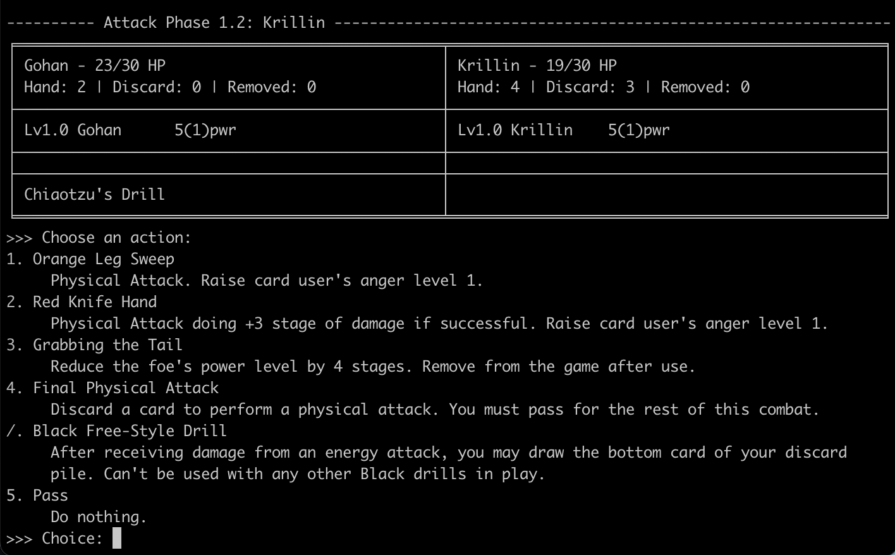

# Text-based DBZ TCG Simulator

## To setup and run

- Clone this repo and navigate to the top directory
- Create and activate a new virtualenv: `python -m venv .venv; . .venv/bin/activate`
- Install the local dbz-tcg package: `python -m pip install -e .`
- Jump into a game: `python ./dbz/play.py -d dbz/decks/goku -d dbz/decks/vegeta -i`
